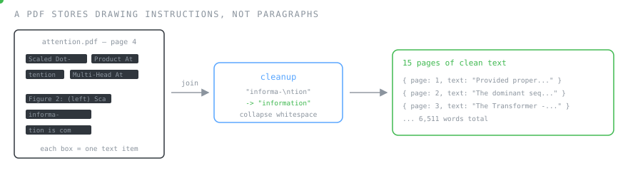
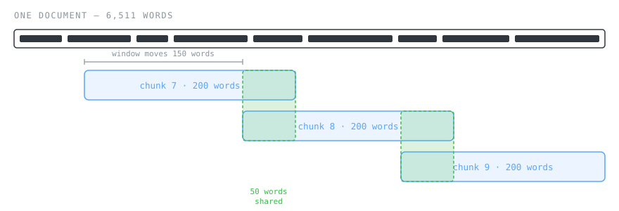
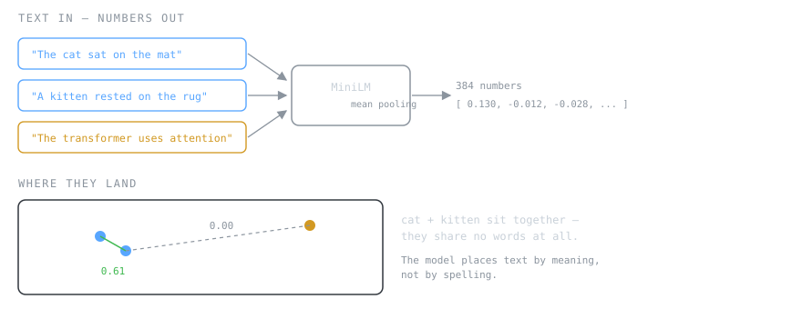
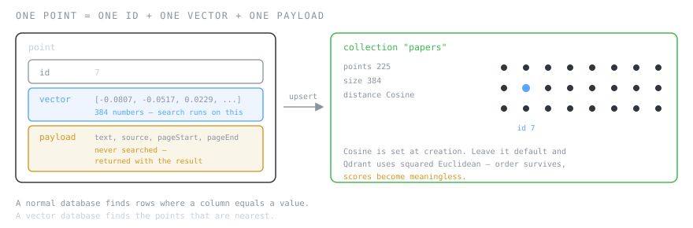
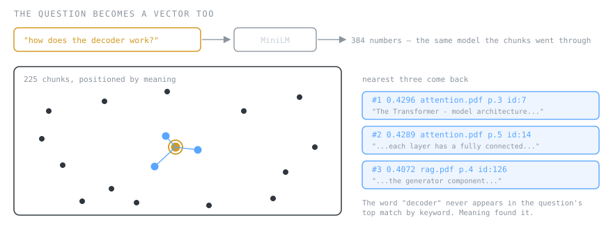
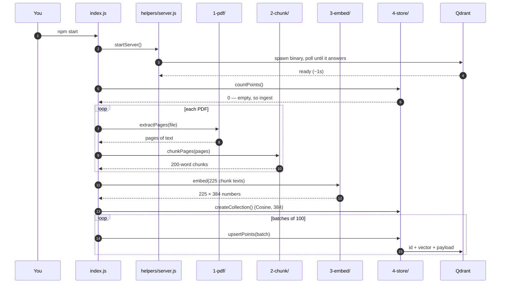
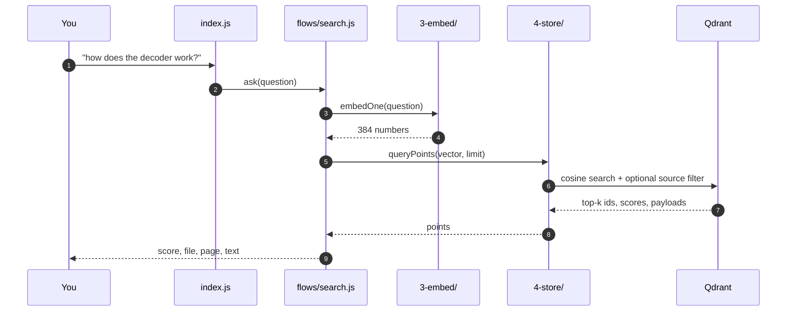

# rag-from-scratch-js

**Learn how RAG retrieval actually works — one step at a time, in plain JavaScript.**

Ask a question in your own words, get back the paragraphs that answer it — even when they
share no words with your question. No API keys, no cloud, no Python.


Every number in this README is real output from this code.

---

## The problem

Ask ChatGPT *"what is our leave policy?"* — it cannot answer. It never read your documents.

You could paste the whole PDF into every prompt. A 20-page document is ~12,000 words:
slow, expensive, and it blows past the model's limit.

Better: paste only the two paragraphs that matter. That is RAG. And the whole difficulty
is one question:

> **Out of 20 pages, how do you find those two paragraphs?**

`Ctrl+F` fails immediately. The user types *"time off"*, the document says *"leave
entitlement"* — no shared words, no results. You need search that matches **meaning**.

Five steps get you there. Each one below follows the same shape:
**what it is → how it works → input/output → diagram → what you should take away.**

---

# Step 1 · PDF → Text

### What it is

Pulling readable text out of a PDF.

### How it works

A PDF does not store paragraphs. It stores instructions like *"draw this glyph at x=213,
y=88"*. Text comes out as hundreds of disconnected fragments that you have to glue back
together.



```js
const content = await page.getTextContent();

let text = '';
for (const item of content.items) {
  text += item.str + (item.hasEOL ? '\n' : ' ');
}
```

Then cleanup. Research papers are full of hyphenated line breaks — leave `informa-\ntion`
as-is and the model sees two broken fragments instead of the word *information*:

```js
raw.replace(/-\n\s*/g, '')      // "informa-\ntion" -> "information"
   .replace(/\s*\n\s*/g, ' ')   // line breaks -> spaces
   .replace(/\s+/g, ' ');       // collapse whitespace
```

### Input → Output

| | |
|---|---|
| **In** | `docs/attention.pdf` |
| **Out** | 15 pages · 6,511 words |

Real extracted text, page 4:

```text
"Scaled Dot-Product Attention Multi-Head Attention Figure 2: (left) Scaled
Dot-Product Attention. (right) Multi-Head Attention consists of several attention
layers running in parallel. of the values, where the weight assigned to each value
is computed by a comp"
```

### Take away

The text is messy — a figure caption sits mid-sentence, the last word is cut off. **That is
normal and mostly harmless.** Hyphenation is the one thing worth fixing, because it
silently corrupts words the model needs to recognise.

> Code: [`src/1-pdf/index.js`](src/1-pdf/index.js)

---

# Step 2 · Text → Chunks

### What it is

> **A chunk is a small slice of a document — here 200 words — that will get its own vector.**

### How it works

You cannot embed a whole paper as one vector:

- The model only reads a few hundred words at a time.
- Even if it could read more, one vector for 15 pages would be so *averaged* that it
  matches nothing specific. Ask about the decoder, get back "a paper about machine
  learning".

So a window slides across the document. **It moves 150 words but is 200 wide** — so every
chunk shares 50 words with the next one.



```js
const step = CHUNK_WORDS - CHUNK_OVERLAP;          // 200 - 50 = 150

for (let start = 0; start < tokens.length; start += step) {
  const window = tokens.slice(start, start + CHUNK_WORDS);
  chunks.push({
    text: window.map((t) => t.word).join(' '),
    source,
    pageStart: window[0].page,
    pageEnd: window.at(-1).page,
  });
}
```

**Why overlap?** Without it, a sentence that happens to land on a boundary exists in *no*
chunk as a complete thought — and retrieval can never find it.

Verified on the real data:

```js
chunk7.split(' ').slice(-50).join(' ') === chunk8.split(' ').slice(0, 50).join(' ')
// true
```

### Input → Output

| | |
|---|---|
| **In** | 6,511 words |
| **Out** | 44 chunks × 200 words |

Chunk 7, which we'll follow for the rest of this README:

```text
The Transformer - model architecture. The Transformer follows this overall
architecture using stacked self-attention and point-wise, fully connected layers
for both the encoder and decoder, shown in the left and right halves of Figure 1,
respectively. 3.1 Encoder and Decoder Stacks Encoder: The encoder is composed of a
stack of N = 6 identical layers. Each layer has two sub-layers... to the encoder,
we employ residual connections around each of
```

### Take away

**Chunk size is the most important knob in the whole system.** Small chunks are precise but
lose context; large chunks carry context but blur. Before anyone reaches for a bigger
model, this is what they tune — `CHUNK_WORDS` in `.env`.

> Code: [`src/2-chunk/index.js`](src/2-chunk/index.js)

---

# Step 3 · Chunk → Vector

### What it is

> **An embedding is text converted into a fixed-length list of numbers, arranged so that similar meanings produce similar lists.**

384 numbers, here. That list is called a **vector**.

### How it works

The model reads text and places it somewhere in a 384-dimensional space. Texts that mean
similar things land near each other — **even with zero words in common**.



Those `0.61` and `0.00` are real scores from this model. *"The cat sat on the mat"* and
*"A kitten rested on the rug"* share **no words** and still score 0.61. The transformer
sentence shares the word "the" and scores 0.00.

**This one property is what makes everything else possible.** Keyword search compares
characters; this compares meaning.

```js
const output = await extractor(texts, { pooling: 'mean', normalize: true });
const vectors = output.tolist();
```

Two options doing real work:

**`pooling: 'mean'`** — the model emits one vector per *word*; this averages them into one
vector for the chunk.

**`normalize: true`** — scales every vector to length exactly 1.0:

```js
Math.sqrt(vector.reduce((s, n) => s + n * n, 0));   // 1.000000
```

Not cosmetic. Once vectors are unit length, the dot product between two of them **is** their
cosine similarity — similarity becomes one multiply-and-add per dimension:

```js
function cosineSimilarity(a, b) {
  let sum = 0;
  for (let i = 0; i < a.length; i++) sum += a[i] * b[i];
  return sum;
}
```

### Input → Output

| | |
|---|---|
| **In** | 1,235 characters of text |
| **Out** | 384 numbers, magnitude `1.000000` |
| **Time** | 166 ms |

```
[-0.0807, -0.0517, 0.0229, -0.0291, 0.0729, -0.0237, -0.0713, -0.0304, ... ]
```

Paused mid-run in the debugger, a batch looks like this — 100 chunks, each an array of
384 floats:

```js
vectors                 // Array(100)
vectors[0]              // Array(384) [-0.0913, -0.1253, 0.0239, ...]
vectors[0].length       // 384
vectors[7]              // Array(384) [-0.0807, -0.0517, 0.0229, ...]  <- chunk 7
```

### Take away

Similarity has a scale, and you need to know it:

| Score | Means |
|---|---|
| `0.7+` | Near-duplicate wording |
| `0.4 – 0.6` | Genuinely relevant |
| `0.2 – 0.3` | Loosely related |
| `< 0.2` | Unrelated — the answer is probably not in your documents |

> Code: [`src/3-embed/index.js`](src/3-embed/index.js) · `Xenova/all-MiniLM-L6-v2`, running locally

---

# Step 4 · Vector → Vector Store

### What it is

> **A vector database stores vectors and answers one question fast: which stored vectors are nearest to this one?**

A normal database finds rows where a column *equals* a value. A vector database finds
points that are *closest* in space.

### How it works

Each entry is a **point** with three parts — and the split matters, because **search only
ever touches the vector**.



```js
await client.upsert('papers', {
  points: [{
    id: 7,
    vector: [-0.0807, -0.0517, 0.0229, ...],
    payload: {
      text: 'The Transformer - model architecture...',
      source: 'attention.pdf',
      pageStart: 3,
      pageEnd: 3,
    },
  }],
});
```

The payload is never searched. It exists so that once you find a match you can show the
text, cite the page, or filter by file.

**The one setting people get wrong:**

```js
await client.createCollection(COLLECTION, {
  vectors: { size: VECTOR_SIZE, distance: 'Cosine' },
});
```

Qdrant defaults to squared Euclidean distance. On normalised vectors that still *ranks*
correctly — but scores come back as meaningless numbers like `0.033`, so every threshold
you set is nonsense. It is easy to ship and hard to notice, because the results still look
ordered.

### Input → Output

| | |
|---|---|
| **In** | 225 vectors + their payloads |
| **Out** | A searchable collection |

```
points: 225   |   size: 384   |   distance: Cosine   |   status: GREEN
```

### Take away

With 225 chunks you could compare against all of them in a `for` loop. At 10 million you
cannot — **that is the only reason a vector database exists.** The arithmetic it
accelerates is exactly the four-line function from Step 3.

> Code: [`src/4-store/index.js`](src/4-store/index.js)

---

# Step 5 · Question → Results

### What it is

Finding the nearest chunks to a question.

### How it works

The question goes through **the exact same embedding model** as the chunks. That is the
whole trick — question and chunks land in the same 384-dimensional space, so "nearest
vector" means "closest meaning".



```js
const vector = await embedOne('how does the decoder work?');

const { points } = await client.query('papers', {
  query: vector,
  limit: 3,
  with_payload: true,
});
```

### Input → Output

| | |
|---|---|
| **In** | `"how does the decoder work?"` |
| **Out** | 3 chunks, ranked by similarity |

```
#1  0.4296  attention.pdf  p.3   id:7
#2  0.4289  attention.pdf  p.5   id:14
#3  0.4072  rag.pdf        p.4   id:126
```

**Result #1 is chunk 7** — the same chunk we followed through every step above.

Each result carries its score, the file, the page and the chunk id, so you can always
trace an answer back to where it came from.

### Take away

The question asks about the *decoder*. Chunk 7 discusses "encoder and decoder stacks", but
it also matched on architecture, layers and sub-layers — **concepts, not keywords**. A
`grep` for "how does the decoder work" returns nothing at all.

> Code: [`src/flows/search.js`](src/flows/search.js)

---

## Run it

```bash
cp .env.example .env
npm install
npm start
```

**Requirements: Node.js 20+.** Nothing else — no Docker, no Python, no accounts.

First run downloads the Qdrant binary for your OS (~35MB) and the embedding model (~23MB),
starts the database, reads the PDFs, and drops you at a prompt. About a minute. Every run
after that, about four seconds.

```
225 chunks ready
Dashboard: http://localhost:6333/dashboard

> what is rag
```

---

## Three things you only learn by running it

### 1. Retrieval always returns something

Ask a question the corpus cannot answer:

```
> how to bake a cake?

#1  0.1501  bert.pdf  p.16
#2  0.1422  bert.pdf  p.16
```

It did not say "not found". **It cannot.** Vector search does not find *correct* answers,
it finds the *least distant* ones — and something is always least distant.

A real match scored **0.43**; this scored **0.15**. That gap is the only signal you get,
which is why `MIN_SCORE` exists in `.env`.

This is the most common bug in real RAG systems: garbage chunks reach the LLM, the LLM
does as it is told and writes an answer out of them, and you get a confident, fluent,
completely wrong response. **The fix is a threshold, not a bigger model.**

### 2. The best chunk is often not #1

Search for *"what is retrieval augmented generation?"* and the chunk with the actual
definition comes back at **#3**. Position #1 goes to a chunk that simply repeats the words
"retrieval" and "generation" more often.

Embeddings capture meaning, but they are not a relevance judge. This is why production
systems retrieve 20–50 chunks fast, then run a slower **reranker** over that shortlist.

### 3. Chunk size changes everything

Change `CHUNK_WORDS` from `200` to `50` in `.env` and re-run:

```bash
npm run db:reset && npm start
```

Chunks get sharper but lose context. Push to `500` and you get the opposite problem.

---

## The two flows, end to end

### Ingest — runs once



### Search — runs per question



---

## Project layout

The folder numbers **are** the step numbers above.

```
index.js              entry point — CLI routing only

src/
  1-pdf/              Step 1 — PDF   -> text
  2-chunk/            Step 2 — text  -> 200-word chunks
  3-embed/            Step 3 — chunk -> 384 numbers
  4-store/            Step 4 — vector -> Qdrant,  Step 5 — search

  flows/
    ingest.js         steps 1 -> 2 -> 3 -> 4
    search.js         steps 3 -> 5

  helpers/
    config.js         reads .env
    server.js         starts Qdrant
    setup.js          downloads the Qdrant binary on first run
    format.js         terminal output

db/                   run by hand, never automatically
  reset.js            drop the collection
  stop.js             stop Qdrant, free the port
  start.js            run Qdrant on its own

docs/                 the PDFs, and the diagrams above
```

---

## Look inside the database

```
http://localhost:6333/dashboard
```

The `papers` collection lists every chunk with its text, source file and page numbers:

```
NAME     STATUS   POINTS   SEGMENTS   VECTORS CONFIG
papers   GREEN    225      5          384 · Cosine
```

Vectors are hidden by default — 384 numbers per point, rarely needed. To see one, open the
**Console** tab:

```
POST /collections/papers/points
{"ids": [7], "with_payload": true, "with_vector": true}
```

---

## What is *not* here

RAG = **R**etrieval **A**ugmented **G**eneration. This project is the **R**. It finds
chunks; it does not write answers.

Deliberate. Adding the **G** is about ten lines:

```js
const points = await search(question, { k: 5 });
const context = points.map((p) => p.payload.text).join('\n\n');

const prompt = `Answer using only the context below.
If it isn't there, say "I don't know".

Context:
${context}

Question: ${question}`;
```

But nobody gets stuck on the **G**. They get stuck on the **R** — and when retrieval
returns the wrong chunks, the best model in the world still answers wrongly.

So this repo makes retrieval something you can watch, measure and break on purpose.

---

## Stack

| | |
|---|---|
| Runtime | Node.js 20+ |
| Embeddings | [Transformers.js](https://github.com/huggingface/transformers.js) · `all-MiniLM-L6-v2`, 384-dim, on your CPU |
| Vector database | [Qdrant](https://qdrant.tech) · local binary, cosine distance, built-in dashboard |
| PDF parsing | [pdfjs-dist](https://mozilla.github.io/pdf.js/) |

Three dependencies. Nothing phones home.

---

## Commands, debugging and troubleshooting

See **[SOP.md](SOP.md)**.

---

## License

MIT
