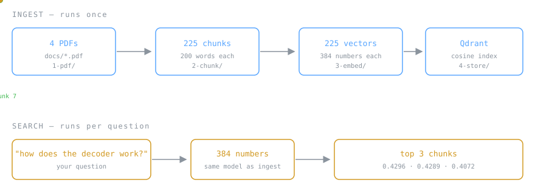
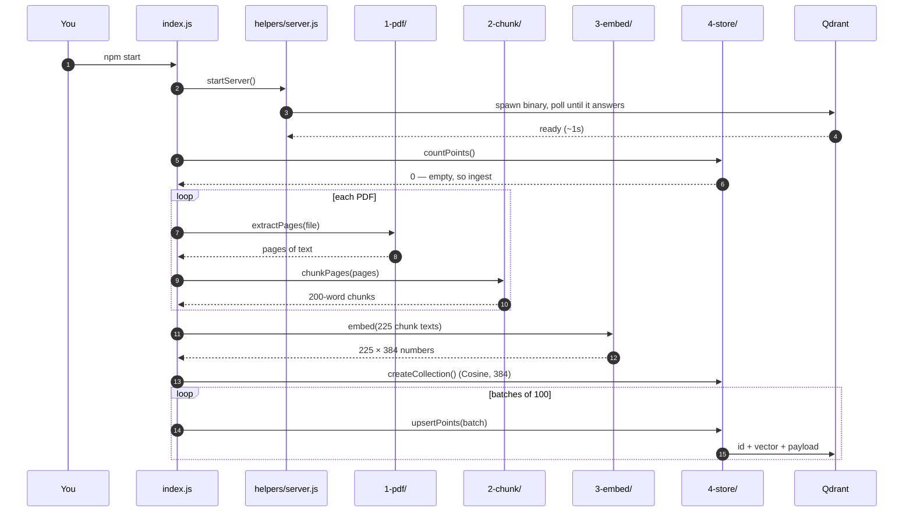
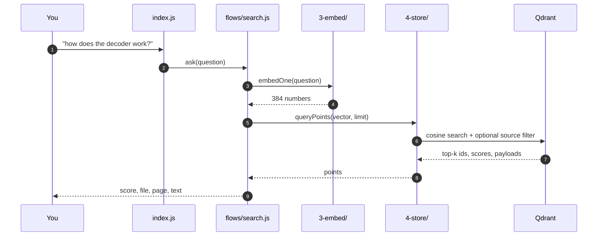

# rag-from-scratch-js

**Semantic search over PDFs, in plain JavaScript. No API keys, no cloud, no Python.**

Ask a question in your own words and get back the paragraphs that actually answer it —
even when they share no words with your question.

This repo is built to be *read*. Every number below is real output from the code in
this repo, not an illustration.



---

## Run it

```bash
cp .env.example .env
npm install
npm start
```

**Requirements: Node.js 20+.** That's the whole list — no Docker, no Python, no accounts.

The first run sets itself up: it downloads the Qdrant binary for your OS (~35MB) and the
embedding model (~23MB), starts the database, reads the PDFs in `docs/`, and drops you at
a prompt. It takes about a minute. Every run after that takes about four seconds.

```
Qdrant start ho raha hai — ready
225 chunks ready
Dashboard: http://localhost:6333/dashboard

> how does the decoder work?
```

---

## Follow one chunk through the whole system

The corpus is four papers: *Attention Is All You Need*, *BERT*, *Sentence-BERT*, and the
*RAG* paper. We'll follow a single piece of text — **chunk 7** — from raw PDF to search
result.

### Step 1 — PDF becomes text

A PDF does not store paragraphs. It stores instructions like *"draw this glyph at x=213,
y=88"*. So the first job is gluing those fragments back into readable text.

**Input:** `docs/attention.pdf` · **Output:** 15 pages, 6,511 words

```text
"Scaled Dot-Product Attention Multi-Head Attention Figure 2: (left) Scaled
Dot-Product Attention. (right) Multi-Head Attention consists of several attention
layers running in parallel. of the values, where the weight assigned to each value
is computed by a comp"
```

Notice the mess: a figure caption sits in the middle of a sentence, and the last word is
cut off. That is normal. Also notice what the cleanup step fixed — research papers are
full of hyphenated line breaks like `informa-\ntion`, and if you leave them, the model
sees two broken fragments instead of the word *information*.

> Code: [`src/1-pdf/index.js`](src/1-pdf/index.js)

### Step 2 — Text becomes chunks

You cannot embed a whole paper as one vector. Two reasons: the model only reads a few
hundred words at a time, and a single vector for 15 pages is so *averaged* that it
matches nothing specific.

**Input:** 6,511 words · **Output:** 44 chunks of 200 words each

Here is chunk 7:

```text
The Transformer - model architecture. The Transformer follows this overall
architecture using stacked self-attention and point-wise, fully connected layers
for both the encoder and decoder, shown in the left and right halves of Figure 1,
respectively. 3.1 Encoder and Decoder Stacks Encoder: The encoder is composed of a
stack of N = 6 identical layers. Each layer has two sub-layers... to the encoder,
we employ residual connections around each of
```

**The overlap.** Chunks are not cut edge to edge. Each one shares its last 50 words with
the next one's first 50 words:

```
chunk 7  ├────────────── 200 words ──────────────┤
chunk 8                          ├────────────── 200 words ──────────────┤
                                 └── 50 shared ──┘
```

Verified on the real data:

```js
chunk7.split(' ').slice(-50).join(' ') === chunk8.split(' ').slice(0, 50).join(' ')
// true
```

That shared text is:

```text
"is also composed of a stack of N = 6 identical layers. In addition to the two
sub-layers in each encoder layer..."
```

Without overlap, a sentence unlucky enough to land on a boundary would exist in *no*
chunk as a complete thought, and retrieval would never find it.

> Code: [`src/2-chunk/index.js`](src/2-chunk/index.js) · Tune with `CHUNK_WORDS` and `CHUNK_OVERLAP` in `.env`

### Step 3 — Chunks become vectors

This is the part that makes semantic search possible. The model reads a chunk and
outputs a list of numbers — a fingerprint of its *meaning*.

**Input:** 1,235 characters of text · **Output:** 384 numbers · **Time:** 166ms

```
[-0.0807, -0.0517,  0.0229, -0.0291,  0.0729, -0.0237, -0.0713, -0.0304, ... ]
 └──────────────────────── 384 numbers total ────────────────────────┘

magnitude = 1.000000
```

Two details that matter:

**Mean pooling.** The model produces one vector per *word*. We average them into a single
vector for the whole chunk.

**Normalisation.** Every vector is scaled to length exactly 1.0. That is why the magnitude
above is `1.000000`, and it is not cosmetic — once vectors are unit length, the dot
product between two of them *is* their cosine similarity. It turns the comparison into
one multiply-and-add per dimension.

> Code: [`src/3-embed/index.js`](src/3-embed/index.js) · Model: `Xenova/all-MiniLM-L6-v2`, runs locally via Transformers.js

### Step 4 — Vectors go into the database

Qdrant stores each chunk as a **point** with three separate parts:

```
point
├── id        7
├── vector    [-0.0807, -0.0517, 0.0229, -0.0291, ...]   ← search runs on this
└── payload   {
      text:      "The Transformer - model architecture. The Transformer follows...",
      source:    "attention.pdf",
      pageStart: 3,
      pageEnd:   3
    }                                                     ← metadata, returned with results
```

The vector and the payload do different jobs. **Search only touches the vector.** The
payload is there so that once a match is found you can show the text, cite the page, or
filter by file. Qdrant does not even send the vector back by default — it is 384 numbers
per point, and you rarely need them.

The collection itself:

```
points: 225  |  distance: Cosine  |  size: 384
```

`distance: Cosine` is worth staring at. Qdrant defaults to squared Euclidean distance.
On a normalised vector set that still *ranks* results correctly, but the scores come out
as meaningless numbers like `0.033` — and then any threshold you set is nonsense. This
project sets Cosine explicitly at collection creation.

> Code: [`src/4-store/index.js`](src/4-store/index.js)

### Step 5 — Searching

A question goes through **the exact same embedding model**. That is the whole trick: the
question and the chunks land in the same 384-dimensional space, so "closest vector" means
"closest meaning".

**Input:** `"how does the decoder work?"` · **Output:**

```
#1  0.4296  attention.pdf  p.3   id:7
#2  0.4289  attention.pdf  p.5   id:14
#3  0.4072  rag.pdf        p.4   id:126
```

**Result #1 is chunk 7** — the one we just followed through the whole pipeline.

And look at what happened: the question asks about the *decoder*. Chunk 7 talks about
"encoder and decoder stacks". But it also matched on architecture, layers, and sub-layers
— concepts, not keywords. A `grep` for "how does the decoder work" would have returned
nothing at all.

> Code: [`src/flows/search.js`](src/flows/search.js)

---

## Three things this project will teach you

### 1. Retrieval always returns something

Ask it a question the corpus cannot possibly answer:

```
> how to bake a cake?

#1  0.1501  bert.pdf  p.16
#2  0.1422  bert.pdf  p.16
```

It did not say "not found". It cannot. Vector search does not find *correct* answers, it
finds the *least distant* ones — and something is always least distant.

Compare the numbers: a real match scored **0.43**, this scored **0.15**. That gap is the
only signal you get, which is why `MIN_SCORE` exists in `.env`. In a full RAG system this
is the single most common bug: garbage chunks get passed to an LLM, and the LLM
confidently writes an answer out of them.

### 2. The best chunk is often not #1

Search this corpus for *"what is retrieval augmented generation?"* and the chunk holding
the actual definition comes back at **#3**, not #1. Position #1 goes to a chunk that
repeats the words "retrieval" and "generation" more often.

This is why production systems retrieve 20–50 chunks quickly, then run a slower, more
accurate *reranker* model over that shortlist.

### 3. Chunk size changes everything

Open `.env`, change `CHUNK_WORDS` from `200` to `50`, and re-run:

```bash
npm run db:reset && npm start
```

Chunks get sharper but lose context. Push it to `500` and you get the opposite. Before
anyone reaches for a bigger embedding model, this is the knob they turn.

---

## How it runs

### Ingest



### Search



---

## Project layout

The folder numbers *are* the execution order.

```
index.js              entry point — CLI routing only

src/
  1-pdf/              PDF  ->  text
  2-chunk/            text ->  200-word chunks
  3-embed/            chunk -> 384 numbers
  4-store/            vector -> Qdrant, and search

  flows/
    ingest.js         1 -> 2 -> 3 -> 4
    search.js         3 -> 4

  helpers/
    config.js         reads .env
    server.js         starts Qdrant
    format.js         terminal output

db/                   run by hand, never automatically
  reset.js            drop the collection
  stop.js             stop Qdrant, free the port
  start.js            run Qdrant on its own

docs/                 the PDFs
```

---

## Look inside the database

```
http://localhost:6333/dashboard
```

Collection `papers`, 225 points. Every chunk with its text, source file and page number.

Vectors are hidden by default. To see one, open the **Console** tab:

```
POST /collections/papers/points
{"ids": [7], "with_payload": true, "with_vector": true}
```

---

## What is *not* here

RAG stands for **R**etrieval **A**ugmented **G**eneration. This project is the **R** only.
It finds chunks; it does not write answers.

That is deliberate. Wiring in an LLM is about ten lines — take the retrieved `text`, put it
in a prompt, send it:

```
Answer using only the context below. If it isn't there, say "I don't know".

Context: {top chunks}
Question: {user question}
```

But nobody gets stuck on the **G**. They get stuck on the **R** — and when retrieval
returns the wrong chunks, the best model in the world will still answer wrongly. So this
repo makes retrieval something you can watch, measure and break on purpose.

---

## Stack

| | |
|---|---|
| Runtime | Node.js 20+ |
| Embeddings | [Transformers.js](https://github.com/huggingface/transformers.js) · `all-MiniLM-L6-v2`, 384-dim, runs on your CPU |
| Vector DB | [Qdrant](https://qdrant.tech) · local binary, cosine distance, built-in dashboard |
| PDF parsing | [pdfjs-dist](https://mozilla.github.io/pdf.js/) |

Three dependencies. Nothing phones home.

---

## Day-to-day commands, debugging and troubleshooting

See **[SOP.md](SOP.md)** — running, resetting, stepping through with a debugger, and what
to do when the database will not start.
