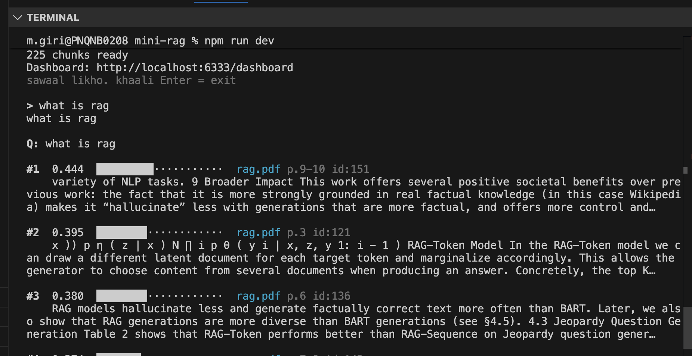
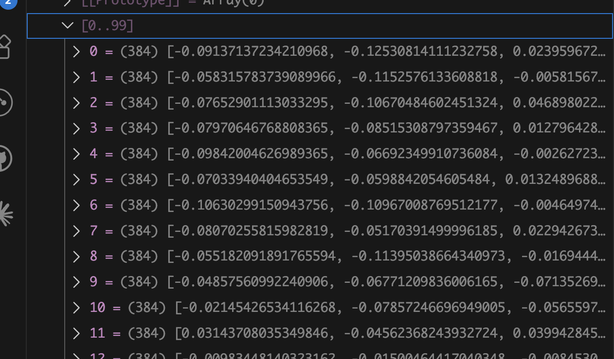
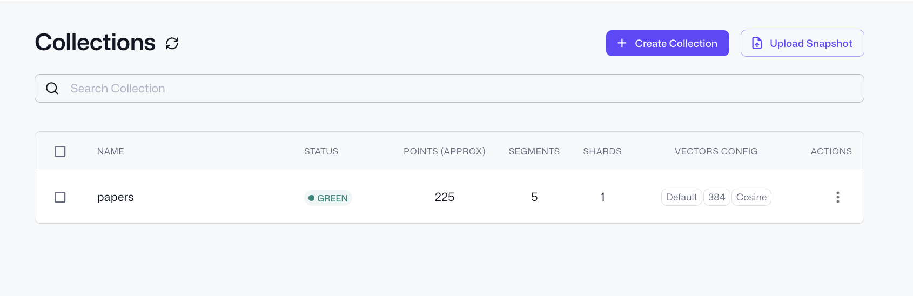
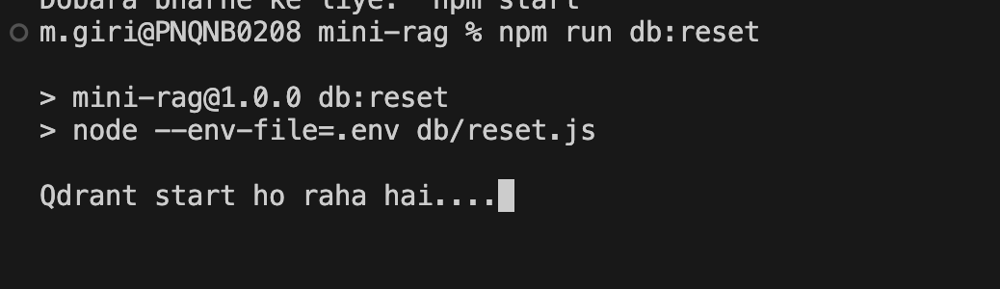
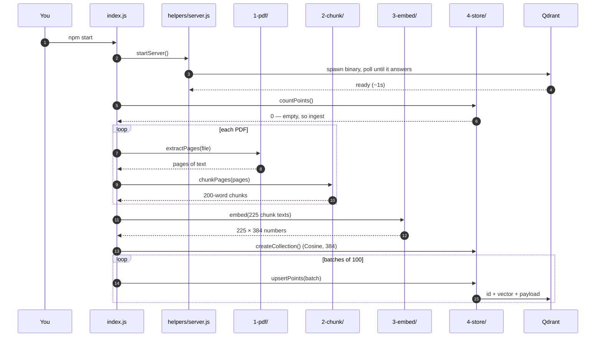
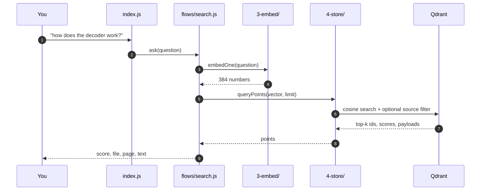

# rag-from-scratch-js

**Learn how RAG retrieval actually works by reading a small, complete implementation of it — in plain JavaScript.**

Ask a question in your own words and get back the paragraphs that answer it, even when
they share no words with your question. No API keys, no cloud, no Python.


Every number in this README is real output from this code, not an illustration.

---

## Contents

1. [The problem RAG solves](#the-problem-rag-solves)
2. [The vocabulary](#the-vocabulary) — embedding, chunk, vector database, cosine similarity
3. [Run it](#run-it)
4. [Follow one chunk through the whole system](#follow-one-chunk-through-the-whole-system)
5. [Three things this project will teach you](#three-things-this-project-will-teach-you)
6. [How it runs](#how-it-runs) — sequence diagrams
7. [Project layout](#project-layout)
8. [What is *not* here](#what-is-not-here)

---

## The problem RAG solves

Ask ChatGPT *"what is our company's leave policy?"* and it cannot answer. It never read
your documents.

You have two options:

**Paste the whole document into the prompt.** A 20-page PDF is roughly 12,000 words. Doing
that on every question is slow, expensive, and eventually exceeds the model's context
limit.

**Paste only the two paragraphs that are relevant.** Fast, cheap, accurate.

The second option is RAG. And the entire difficulty sits in one question:

> Out of 20 pages, how do you *find* the two relevant paragraphs?

`Ctrl+F` will not do it. The user types "time off", the document says "leave
entitlement" — zero word overlap, zero results. You need search that matches **meaning**,
not characters. That is what this project builds.

---

## The vocabulary

Four ideas. Once these click, the rest of the code is mechanical.

### Embedding

> **An embedding is a piece of text converted into a fixed-length list of numbers, arranged so that texts with similar meanings produce similar lists.**

A model reads a sentence and outputs — in this project — 384 numbers. That list is called
a **vector**. It is a fingerprint of meaning.

```js
const [vector] = await embed(['The cat sat on the mat']);

vector.length;        // 384
vector.slice(0, 4);   // [0.1301, -0.0124, -0.0286, 0.0511]
```

The useful property is what happens when you compare two of them. "The cat sat on the mat"
and "A kitten rested on the rug" share **no words at all** — yet their vectors land close
together, because the model was trained on meaning, not spelling.

This is the one idea that makes everything else possible. Keyword search compares
characters; vector search compares meaning.

### Chunk

> **A chunk is a small slice of a document — here, 200 words — that gets its own embedding.**

You cannot embed a whole paper as one vector, for two reasons:

- The model only reads a few hundred words at a time.
- Even if it could read more, one vector for 15 pages would be so *averaged out* that it
  would match no specific question. Ask about the decoder and you'd get a vector
  representing "a paper about machine learning".

So documents are cut into chunks. Small chunks are precise but lose context; large chunks
carry context but blur. **This trade-off is the single most important knob in any RAG
system**, and it lives in `.env` as `CHUNK_WORDS`.

### Vector database

> **A vector database stores vectors and answers one question fast: which stored vectors are closest to this one?**

A normal database finds rows where a column *equals* a value. A vector database finds
points that are *nearest* in space. With 225 chunks you could compare against all of them
in a loop. With 10 million, you need real indexing — which is what [Qdrant](https://qdrant.tech)
provides here.

Each entry is called a **point**, and has three parts:

```js
{
  id: 7,
  vector: [-0.0807, -0.0517, 0.0229, ...],   // 384 numbers — search runs on this
  payload: { text, source, pageStart, pageEnd }  // everything else — returned with results
}
```

The split matters: **search only ever touches the vector.** The payload exists so that
once you find a match you can show the text, cite the page, or filter by file.

### Cosine similarity

> **Cosine similarity measures the angle between two vectors: 1.0 means identical direction, 0 means unrelated.**

It is how "closeness" gets a number. And when every vector has been scaled to length 1 —
which this project does — the maths collapses into a single loop:

```js
function cosineSimilarity(a, b) {
  let sum = 0;
  for (let i = 0; i < a.length; i++) sum += a[i] * b[i];
  return sum;
}
```

That is the whole thing. Multiply matching positions, add them up. Qdrant does this for
you across millions of points with clever indexing, but the arithmetic it is accelerating
is exactly those four lines.

Typical values on real text:

| Score | Means |
|---|---|
| `0.7+` | Near-duplicate wording |
| `0.4 – 0.6` | Genuinely relevant |
| `0.2 – 0.3` | Loosely related |
| `< 0.2` | Unrelated — the answer is probably not in your documents |

---

## Run it

```bash
cp .env.example .env
npm install
npm start
```

**Requirements: Node.js 20+.** That is the whole list — no Docker, no Python, no accounts.

The first run sets itself up: it downloads the Qdrant binary for your OS (~35MB) and the
embedding model (~23MB), starts the database, reads the PDFs in `docs/`, and drops you at
a prompt. About a minute. Every run after that, about four seconds.

```
225 chunks ready
Dashboard: http://localhost:6333/dashboard

> what is rag
```



Each result shows its similarity score, the file, the page, and the chunk id.

---

## Follow one chunk through the whole system

The corpus is four papers: *Attention Is All You Need*, *BERT*, *Sentence-BERT*, and the
*RAG* paper. We'll follow one piece of text — **chunk 7** — from raw PDF to search result.

### Step 1 — PDF becomes text

A PDF does not store paragraphs. It stores instructions like *"draw this glyph at x=213,
y=88"*. The first job is gluing those fragments back into readable text.

**Input:** `docs/attention.pdf` → **Output:** 15 pages, 6,511 words

```js
const pages = await extractPages('docs/attention.pdf');
// [{ page: 1, text: "Provided proper attribution is provided, Google hereby..." }, ...]
```

Here is real extracted text, from page 4:

```text
"Scaled Dot-Product Attention Multi-Head Attention Figure 2: (left) Scaled
Dot-Product Attention. (right) Multi-Head Attention consists of several attention
layers running in parallel. of the values, where the weight assigned to each value
is computed by a comp"
```

Notice the mess: a figure caption sits in the middle of a sentence, and the last word is
cut off. That is normal, and mostly harmless.

One thing that is *not* harmless — research papers are full of hyphenated line breaks like
`informa-\ntion`. Leave them in and the model sees two broken fragments instead of the
word *information*. So the cleanup step handles it:

```js
raw.replace(/-\n\s*/g, '')      // "informa-\ntion" -> "information"
   .replace(/\s*\n\s*/g, ' ')
   .replace(/\s+/g, ' ')
```

> Code: [`src/1-pdf/index.js`](src/1-pdf/index.js)

### Step 2 — Text becomes chunks

**Input:** 6,511 words → **Output:** 44 chunks of 200 words each

The chunker walks the document in a sliding window, keeping track of which page each word
came from:

```js
const step = CHUNK_WORDS - CHUNK_OVERLAP;          // 200 - 50 = 150

for (let start = 0; start < tokens.length; start += step) {
  const window = tokens.slice(start, start + CHUNK_WORDS);
  chunks.push({
    text: window.map((t) => t.word).join(' '),
    source,
    pageStart: window[0].page,
    pageEnd: window.at(-1).page,
  });
}
```

Chunk 7 comes out as:

```text
The Transformer - model architecture. The Transformer follows this overall
architecture using stacked self-attention and point-wise, fully connected layers
for both the encoder and decoder, shown in the left and right halves of Figure 1,
respectively. 3.1 Encoder and Decoder Stacks Encoder: The encoder is composed of a
stack of N = 6 identical layers. Each layer has two sub-layers... to the encoder,
we employ residual connections around each of
```

**Why the window slides by 150 instead of 200.** Chunks are not cut edge to edge. Each one
shares its last 50 words with the next one's first 50:

```
chunk 7  ├────────────── 200 words ──────────────┤
chunk 8                          ├────────────── 200 words ──────────────┤
                                 └── 50 shared ──┘
```

Verified against the real data:

```js
chunk7.split(' ').slice(-50).join(' ') === chunk8.split(' ').slice(0, 50).join(' ')
// true
```

That shared text is:

```text
"is also composed of a stack of N = 6 identical layers. In addition to the two
sub-layers in each encoder layer..."
```

Without overlap, a sentence unlucky enough to land on a boundary would exist in **no**
chunk as a complete thought, and retrieval would never find it.

> Code: [`src/2-chunk/index.js`](src/2-chunk/index.js) · Tune `CHUNK_WORDS` and `CHUNK_OVERLAP` in `.env`

### Step 3 — Chunks become vectors

**Input:** 1,235 characters of text → **Output:** 384 numbers → **Time:** 166ms

```js
const output = await extractor(texts, { pooling: 'mean', normalize: true });
const vectors = output.tolist();
```

Here are the real vectors mid-run, paused in the VS Code debugger — 100 chunks in this
batch, each one an array of 384 floats:



Two options in that call do a lot of work:

**`pooling: 'mean'`** — the model produces one vector per *word*. Mean pooling averages
them into a single vector for the whole chunk.

**`normalize: true`** — every vector is scaled to length exactly 1.0:

```js
Math.sqrt(vector.reduce((s, n) => s + n * n, 0));   // 1.000000
```

This is not cosmetic. Once vectors are unit length, the dot product between two of them
*is* their cosine similarity — the division in the cosine formula becomes division by 1.
It turns similarity into one multiply-and-add per dimension.

> Code: [`src/3-embed/index.js`](src/3-embed/index.js) · Model: `Xenova/all-MiniLM-L6-v2`, running locally through Transformers.js

### Step 4 — Vectors go into the database

```js
await client.upsert('papers', {
  points: [{
    id: 7,
    vector: [-0.0807, -0.0517, 0.0229, ...],
    payload: {
      text: 'The Transformer - model architecture...',
      source: 'attention.pdf',
      pageStart: 3,
      pageEnd: 3,
    },
  }],
});
```

The collection as the dashboard shows it:



`225` points, `384` dimensions, `Cosine` distance.

**That `Cosine` is worth staring at.** Qdrant defaults to squared Euclidean distance. On a
normalised vector set that still *ranks* results correctly — but the scores come back as
meaningless numbers like `0.033`, and any threshold you set on them is nonsense. So the
collection sets it explicitly:

```js
await client.createCollection(COLLECTION, {
  vectors: { size: VECTOR_SIZE, distance: 'Cosine' },
});
```

This is a real bug that is easy to ship and hard to notice, because your results still
*look* ordered correctly.

> Code: [`src/4-store/index.js`](src/4-store/index.js)

### Step 5 — Searching

The question goes through **the exact same embedding model** as the chunks. That is the
whole trick: question and chunks land in the same 384-dimensional space, so "nearest
vector" means "closest meaning".

```js
const vector = await embedOne('how does the decoder work?');

const { points } = await client.query('papers', {
  query: vector,
  limit: 3,
  with_payload: true,
});
```

**Output:**

```
#1  0.4296  attention.pdf  p.3   id:7
#2  0.4289  attention.pdf  p.5   id:14
#3  0.4072  rag.pdf        p.4   id:126
```

**Result #1 is chunk 7** — the one we just followed the whole way through.

And look at what happened. The question asks about the *decoder*. Chunk 7 discusses
"encoder and decoder stacks", but it also matched on architecture, layers and sub-layers —
concepts, not keywords. A `grep` for "how does the decoder work" would have returned
nothing at all.

> Code: [`src/flows/search.js`](src/flows/search.js)

---

## Three things this project will teach you

### 1. Retrieval always returns something

Ask a question the corpus cannot possibly answer:

```
> how to bake a cake?

#1  0.1501  bert.pdf  p.16
#2  0.1422  bert.pdf  p.16
```

It did not say "not found". **It cannot.** Vector search does not find *correct* answers,
it finds the *least distant* ones — and something is always least distant.

Compare: a real match scored **0.43**, this scored **0.15**. That gap is the only signal
you get, which is why `MIN_SCORE` exists in `.env`.

In a full RAG system this is the single most common bug. Garbage chunks get passed to an
LLM, the LLM does what it is told and writes an answer out of them, and the result is a
confident, fluent, completely wrong response. The fix is not a better model — it is a
threshold.

### 2. The best chunk is often not #1

Search this corpus for *"what is retrieval augmented generation?"* and the chunk holding
the actual definition comes back at **#3**. Position #1 goes to a chunk that simply
repeats the words "retrieval" and "generation" more often.

Embeddings capture meaning, but they are not a relevance judge. This is why production
systems retrieve 20–50 chunks quickly, then run a slower, more accurate **reranker** model
over that shortlist.

### 3. Chunk size changes everything

Open `.env`, change `CHUNK_WORDS` from `200` to `50`, and re-run:

```bash
npm run db:reset && npm start
```



Chunks get sharper but lose their surrounding context. Push it to `500` and you get the
opposite problem. Before anyone reaches for a bigger embedding model, this is the knob
they turn.

---

## How it runs

### Ingest



### Search



---

## Project layout

The folder numbers **are** the execution order.

```
index.js              entry point — CLI routing only

src/
  1-pdf/              PDF   ->  text
  2-chunk/            text  ->  200-word chunks
  3-embed/            chunk ->  384 numbers
  4-store/            vector -> Qdrant, and search

  flows/
    ingest.js         1 -> 2 -> 3 -> 4
    search.js         3 -> 4

  helpers/
    config.js         reads .env
    server.js         starts Qdrant
    setup.js          downloads the Qdrant binary on first run
    format.js         terminal output

db/                   run by hand, never automatically
  reset.js            drop the collection
  stop.js             stop Qdrant, free the port
  start.js            run Qdrant on its own

docs/                 the PDFs
```

---

## Look inside the database

```
http://localhost:6333/dashboard
```

Every chunk with its text, source file and page number.

Vectors are hidden by default — 384 numbers per point, and you rarely need them. To see
one, open the **Console** tab:

```
POST /collections/papers/points
{"ids": [7], "with_payload": true, "with_vector": true}
```

---

## What is *not* here

RAG stands for **R**etrieval **A**ugmented **G**eneration. This project is the **R** only.
It finds chunks; it does not write answers.

That is deliberate. Wiring in an LLM is about ten lines — take the retrieved `text`, put it
in a prompt, send it:

```js
const points = await search(question, { k: 5 });
const context = points.map((p) => p.payload.text).join('\n\n');

const prompt = `Answer using only the context below.
If it isn't there, say "I don't know".

Context:
${context}

Question: ${question}`;
```

But nobody gets stuck on the **G**. They get stuck on the **R** — and when retrieval
returns the wrong chunks, the best model in the world will still answer wrongly.

So this repo makes retrieval something you can watch, measure, and break on purpose.

---

## Stack

| | |
|---|---|
| Runtime | Node.js 20+ |
| Embeddings | [Transformers.js](https://github.com/huggingface/transformers.js) · `all-MiniLM-L6-v2`, 384-dim, runs on your CPU |
| Vector database | [Qdrant](https://qdrant.tech) · local binary, cosine distance, built-in dashboard |
| PDF parsing | [pdfjs-dist](https://mozilla.github.io/pdf.js/) |

Three dependencies. Nothing phones home.

---

## Commands, debugging and troubleshooting

See **[SOP.md](SOP.md)** — running, resetting, stepping through the pipeline with a
debugger, and what to do when the database will not start.

---

## License

MIT
